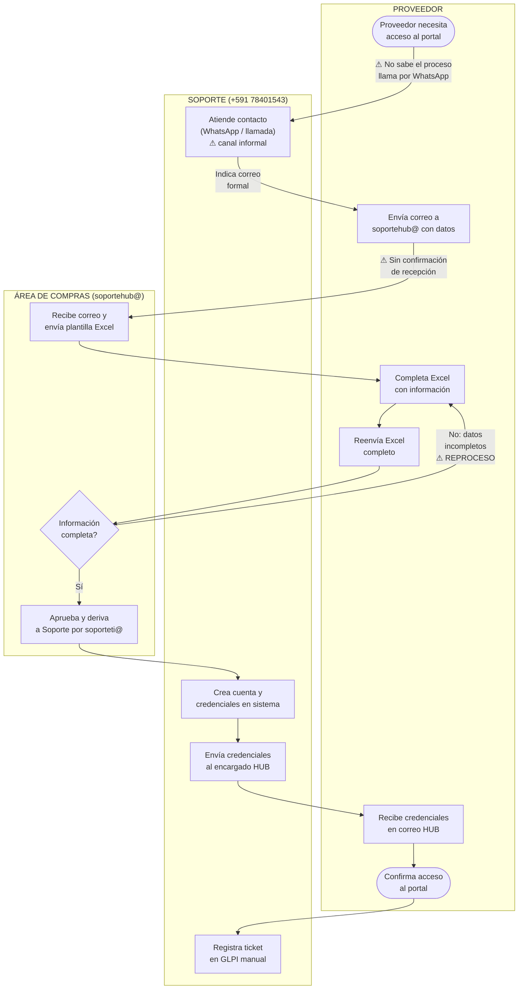
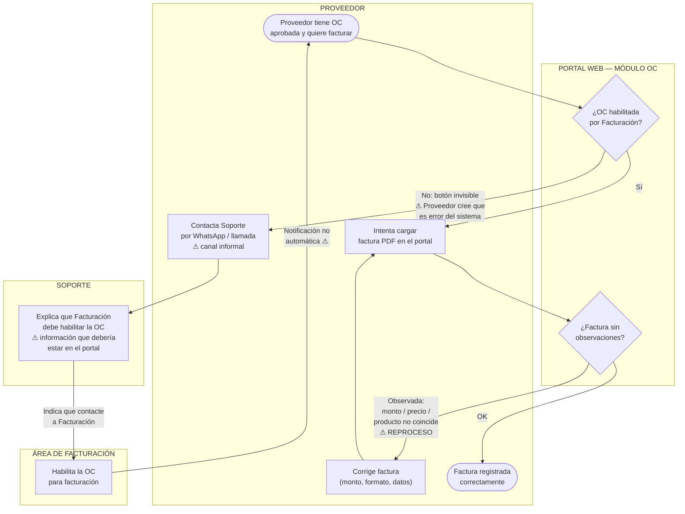
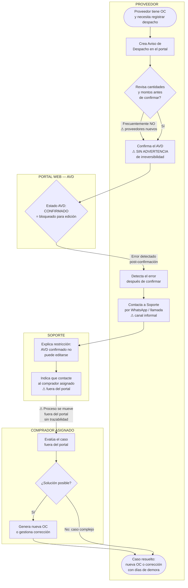
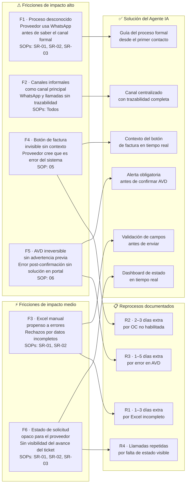

# EP-01-S02 — Diagrama de Flujo de Procesos Actuales (AS-IS)

> **Proyecto:** Asistente Virtual de Soporte — Portal de Proveedores Hipermaxi  
> **Sprint:** EP-01 · Subtask S02  
> **Basado en:** SOP-SR-01, SOP-SR-02, SOP-SR-03, SOP-04, SOP-05, SOP-06  
> **Versión:** 2.0 — diagramas separados, fricciones con reprocesos documentados

---

## S1 — Mapeo de actores y canales actuales

| Actor | Rol en el proceso | Canales actuales | Tipo de canal | Fricción asociada |
|---|---|---|---|---|
| **Proveedor** (Enc. HUB / Sistemas / Comercial) | Solicitante y operador del portal | WhatsApp, correo electrónico, llamada telefónica | Informal + formal | Sin trazabilidad en canales informales |
| **Soporte Hipermaxi** | Atención técnica y orientación | WhatsApp +591 78401543, teléfono corporativo, soporteti@hipermaxi.com | Informal predominante | Canal informal usado como principal |
| **Área de Compras** | Validación comercial y aprobación | soportehub@hipermaxi.com, Excel de registro manual | Formal pero manual | Proceso opaco para el proveedor |
| **Área de Facturación** | Habilitación de OC para facturar | Contacto directo con el proveedor | Informal | No hay notificación automática al proveedor |
| **Comprador asignado** | Resolución de casos AVD con error | WhatsApp, llamada directa | Informal | Sin registro del incidente |
| **Sistema GLPI** | Gestión de tickets de soporte | Registro manual por Soporte | Interno | Sin visibilidad para el proveedor |

---

## S2 — AS-IS: Solicitud de credenciales (SOP-SR-01)

**Puntos de fricción — SOP-SR-01:**

| # | Fricción | Paso donde ocurre | Reproceso generado | Impacto |
|---|---|---|---|---|
| F1 | Proveedor no sabe el proceso formal y usa WhatsApp | Paso inicial | Llamada + redirección al correo formal | Alto |
| F2 | Sin confirmación de recepción del correo a soportehub | Envío del correo | El proveedor llama para verificar si llegó | Alto |
| F3 | Excel con datos incompletos — solicitud devuelta | Validación de Compras | Completar y reenviar el Excel (1–3 días extra) | Alto |
| F6 | Sin visibilidad del estado del ticket en GLPI | Todo el proceso | El proveedor llama a Soporte para saber en qué paso está | Medio |

---

## S3 — AS-IS: Carga de factura (SOP-05)

**Puntos de fricción — SOP-05:**

| # | Fricción | Paso donde ocurre | Reproceso generado | Impacto |
|---|---|---|---|---|
| F4a | Botón de factura invisible — proveedor cree que es error del sistema | Intento de carga | Llamada a Soporte + explicación + contacto a Facturación (2–3 días) | Alto |
| F4b | Sin notificación automática cuando la OC queda habilitada | Habilitación por Facturación | Proveedor debe volver a intentar manualmente sin saber cuándo | Alto |
| F4c | Factura observada sin guía clara de corrección | Validación del portal | Corregir factura y volver a cargar (1–2 intentos adicionales) | Medio |
| F2 | Consulta resuelta por WhatsApp sin registro | Contacto a Soporte | Sin trazabilidad de la interacción | Alto |

---

## S4 — AS-IS: Aviso de Despacho (SOP-06)

**Puntos de fricción — SOP-06:**

| # | Fricción | Paso donde ocurre | Reproceso generado | Impacto |
|---|---|---|---|---|
| F5a | Sistema confirma AVD sin advertencia de irreversibilidad | Confirmación del AVD | Error no prevenible — obliga a gestión externa | Alto |
| F5b | AVD con error obliga al proveedor a salir del portal | Post-confirmación | Llamada a Soporte + derivación a comprador (1–5 días) | Alto |
| F5c | Resolución del error AVD ocurre fuera del portal | Gestión con comprador | Sin trazabilidad del incidente en el sistema | Alto |
| F2 | Toda la gestión del error va por WhatsApp / llamada | Contacto a Soporte | Sin registro auditable de la incidencia | Alto |

---

## S5 — Consolidado de puntos de fricción y reprocesos

---

## S6 — Tabla resumen ejecutivo completa

| # | Fricción | SOP(s) | Actor afectado | Reproceso generado | Días extra aprox. | Impacto | Solución IA |
|---|---|---|---|---|---|---|---|
| F1 | Proveedor desconoce el proceso formal — usa WhatsApp primero | SR-01, SR-02, SR-03 | Proveedor HUB / Comercial | Llamada + redirección al canal formal | 0–1 día | Alto | Guía del proceso desde el primer contacto |
| F2 | WhatsApp y llamadas como canal principal — sin trazabilidad | Todos | Proveedor / Soporte | Sin registro auditable de la interacción | Variable | Alto | Canal centralizado con historial |
| F3 | Excel manual con datos incompletos — solicitud rechazada | SR-01, SR-02 | Proveedor Comercial | Completar y reenviar el Excel | 1–3 días | Alto | Formulario guiado con validación en tiempo real |
| F4a | Botón de factura invisible sin contexto para el proveedor | SOP-05 | Proveedor HUB | Llamada a Soporte + esperar habilitación por Facturación | 2–3 días | Alto | Explicación contextual + derivación a Facturación con un clic |
| F4b | Sin notificación cuando la OC queda habilitada para facturar | SOP-05 | Proveedor HUB | Reintentar manualmente sin saber cuándo | 1–2 días | Alto | Notificación automática al proveedor |
| F5a | AVD confirmado sin advertencia de irreversibilidad | SOP-06 | Proveedor HUB | Error no prevenible — gestión externa | 1–5 días | Alto | Alerta obligatoria antes de confirmar |
| F5b | Resolución del error AVD ocurre fuera del portal | SOP-06 | Proveedor / Soporte / Compras | Llamada + derivación al comprador asignado | 1–5 días | Alto | Registro del incidente + derivación trazable |
| F6 | Estado del ticket opaco — el proveedor no sabe en qué paso está | SR-01, SR-02, SR-03 | Proveedor HUB / Comercial | Llamadas repetidas a Soporte para saber el estado | 0–1 día | Medio | Dashboard de estado en tiempo real |
