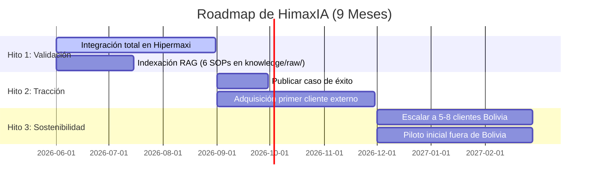
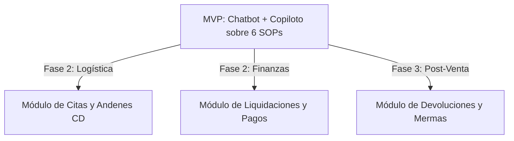

# EP-09 — Modelo de Negocio (HimaxIA)

Este documento consolida la definición estratégica, los entregables del pitch, el análisis de retorno de inversión (ROI) calibrado, la estructura de costos reales y el roadmap de escalabilidad de **HimaxIA**, desarrollado por el equipo **LosQuematokens** para el Innova Hack Santa Cruz 2026.

> **HimaxIA no es un solo chatbot: son DOS sistemas complementarios** embebidos en el mismo widget del Portal de Proveedores de Hipermaxi — un **Chatbot** de consulta y un **Copiloto** de guía asistida sobre el portal.

---

## 0. Los dos sistemas de HimaxIA

HimaxIA se compone de **dos productos independientes y complementarios**, ambos sobre el mismo widget embebido en el portal:

| Sistema | Qué es | Cómo funciona | Tecnología |
| :--- | :--- | :--- | :--- |
| **🟢 Chatbot (Consulta)** | Responde preguntas en lenguaje natural sobre procesos, normativas y trámites del portal. | Es conversacional: el proveedor pregunta, el Chatbot responde. **Toma sus respuestas como referencia de los archivos de la carpeta `knowledge/raw/`** (SOPs y documentación operativa de Hipermaxi) mediante un pipeline RAG. No actúa sobre el portal: solo informa. | **API Gemini #1** + embeddings + vector DB (RAG sobre `knowledge/raw/`) |
| **🔵 Copiloto (Guía asistida)** | Guía visual **paso a paso** sobre el propio portal, de forma **no intrusiva** (estilo "Claude"), antes de transacciones críticas. | **Menos errores irreversibles**, gracias al Copiloto (Nivel 3) que guía paso a paso, de forma visual y no intrusiva, el flujo correcto antes de transacciones críticas (envío de AVD o carga de factura). El Copiloto **no corrige ni completa datos por el proveedor**: lo orienta y el proveedor **confirma cada acción** (human-in-the-loop). | **API Gemini #2** + overlay sobre el DOM del portal |

> **Regla no negociable:** el Copiloto **nunca ejecuta acciones por sí solo**. Toda acción irreversible (confirmar AVD, enviar factura, guardar producto) pasa por una confirmación humana explícita (ConfirmModal). El Copiloto orienta; el proveedor decide.

---

## 1. Identidad y Propuesta de Valor Única (PVU)

* **Nombre Comercial:** **HimaxIA**
* **Descriptor Técnico:** *Chatbot de Consulta (RAG) + Copiloto de Guía Asistida en el DOM (Web Companion) para Retail.*
* **Frase de Posicionamiento para el Pitch:**
  > **"HimaxIA es la dupla B2B —Chatbot + Copiloto— que automatiza el soporte operativo de proveedores en el portal de Hipermaxi, transformando la sobrecarga de la atención manual por WhatsApp en autoservicio 24/7 y reduciendo las fricciones del portal a cero."**

### Tabla de Valor Diferencial y Beneficios Cuantificables

| Dimensión | Valor Estratégico | Beneficios Concretos y Cuantificables |
| :--- | :--- | :--- |
| **Para Hipermaxi**<br>*(Cliente B2B)* | **Optimización y Formalidad:**<br>- Reducción radical de carga operativa básica.<br>- Formalización de la comunicación.<br>- Trazabilidad integral de las interacciones. | 1. **Reducción del 70% en la carga operativa** del equipo de soporte (Soporte HUB, Compras, TI), al absorber automáticamente consultas sobre accesos y registro de catálogos.<br>2. **Recuperación de 58 horas mensuales de trabajo operativo** que hoy el personal malgasta actuando como "call center de contraseñas" y respondiendo correos repetitivos.<br>3. **100% de trazabilidad operativa y mitigación de disputas**, migrando la comunicación desde canales informales (WhatsApp corporativo `+591 78401543`) a un log de auditoría centralizado. |
| **Para el Proveedor**<br>*(Usuario del Portal)* | **Eficiencia y Autonomía:**<br>- Autoservicio 24/7 sin barreras temporales.<br>- Resolución inmediata en pantalla.<br>- Eliminación de fricción operativa. | 1. **Disponibilidad 24/7 y resolución inmediata (en < 5 segundos)** de dudas funcionales gracias al **Chatbot**, evitando el tiempo de espera promedio actual de 2 a 4 días por correo electrónico.<br>2. **Menos errores irreversibles**, gracias al **Copiloto (Nivel 3)** que **guía paso a paso, de forma visual y no intrusiva**, el flujo correcto antes de transacciones críticas (envío de AVD o carga de factura). El Copiloto **no corrige ni completa** datos por el proveedor: lo orienta y el proveedor confirma cada acción (human-in-the-loop).<br>3. **Soporte guiado en obtención de credenciales**, indicando paso a paso cómo solicitarlas (`SOP-SR-01`) y recuperar accesos (`SOP-SR-03`) de forma segura, sin entregar directamente credenciales activas o información confidencial. |

### Frase de Posicionamiento para la Portada del Pitch

> **"HimaxIA es el dúo inteligente B2B —Chatbot que responde y Copiloto que guía— que automatiza el soporte operativo de proveedores en el portal de Hipermaxi, transformando el caos de la atención manual por WhatsApp en autoservicio 24/7 libre de fricciones."**

---

## 2. Business Model Canvas (BMC) Unificado

```mermaid
graph TD
    subgraph "HimaxIA Business Model Canvas"
        direction TB
        KP[<b>Aliados Clave</b><br>- Hipermaxi (Cliente Ancla)<br>- Google Cloud (Créditos)<br>- CAINCO Santa Cruz<br>- Integradores ERP locales]
        KA[<b>Actividades Clave</b><br>- Refinamiento RAG / Chunking<br>- Onboarding documental<br>- Reporte mensual automático]
        KR[<b>Recursos Clave</b><br>- Base de SOPs vectorizados (knowledge/raw/)<br>- 2 APIs de Gemini Flash (Chatbot + Copiloto)<br>- Widget de 26KB en Preact]
        VP[<b>Propuestas de Valor</b><br><b>Hipermaxi:</b> -70% carga soporte, logs 100% auditables.<br><b>Proveedor:</b> Chatbot <5s 24/7 + Copiloto guía paso a paso.]
        CR[<b>Relación con Clientes</b><br>- CSM dedicado (Piloto)<br>- Reportes de impacto mensuales<br>- Onboarding automatizado]
        CH[<b>Canales</b><br>- Venta directa B2B (COO)<br>- Alianzas con consultoras IT<br>- LinkedIn B2B Outreach]
        CS[<b>Segmentos de Clientes</b><br>- Hipermaxi (Caso de Éxito)<br>- Supermercados Bolivia (Ketal, Fidalga)<br>- Retailers medianos LATAM]
        CST[<b>Estructura de Costos</b><br>- Nómina reducida 4 personas<br>- 2 APIs Gemini & Cloud Hosting<br>- Contabilidad y Legal]
        REV[<b>Fuentes de Ingresos</b><br>- Suscripción Starter: $149/mes<br>- Suscripción Professional: $399/mes]
    end
```

### Detalle de los 9 Bloques:

1. **Segmentos de Clientes (Customer Segments):**
   * **Cliente Ancla (Fase Pilotaje):** *Hipermaxi S.A.* (Red de más de 300 proveedores activos).
   * **Mercado SAM (Bolivia, Años 1-2):** Cadenas de retail y supermercados medianos con portales de autogestión de proveedores (*Ketal*, *Fidalga*, *IC Norte*).
   * **Mercado TAM (LATAM, Año 3+):** Supermercados y distribuidoras medianas en Perú, Ecuador y Colombia que operen con flujos de Aviso de Despacho (AVD), catálogo de productos y carga de facturas.
2. **Propuestas de Valor (Value Propositions):**
   * **Para el Retailer (Hipermaxi):** Reduce en un **70% la carga operativa** del departamento de soporte de compras/TI; recupera **58 horas mensuales** de personal técnico y administrativo; mitiga el 100% de las disputas operativas mediante un log auditable centralizado en el portal.
   * **Para el Proveedor:** dos formas de ayuda — (a) **Chatbot** de soporte interactivo **24/7 con respuestas en <5 segundos** (basado en `knowledge/raw/`) en lugar de esperar 2 a 4 días hábiles por correo, y (b) **Copiloto** que **guía paso a paso, de forma visual y no intrusiva**, los procesos del portal (el proveedor acepta o no cada paso; el Copiloto no corrige ni completa por él).
3. **Canales (Channels):**
   * Venta B2B directa enfocada en el Director de Compras, COO o Gerente de Tecnología (TI).
   * Alianzas estratégicas con consultoras locales de software e integradores de ERP que ya provean servicios a las cadenas de supermercados.
   * Presencia orgánica y outreach dirigido en LinkedIn a gerentes de Supply Chain y Operaciones en Bolivia.
4. **Relación con Clientes (Customer Relationships):**
   * **Piloto:** Acompañamiento cercano y personalizado mediante un Customer Success Manager (CSM) dedicado (miembro fundador).
   * **Escala SaaS:** Portal de Onboarding automatizado para que el cliente configure e indexe sus propios SOPs de manera autónoma, con reportes automatizados de ROI entregados mensualmente por correo electrónico.
5. **Fuentes de Ingresos (Revenue Streams):**
   * **Suscripción Starter ($149 USD/mes):** Diseñada para retailers pequeños/medianos. Soporta hasta 300 proveedores activos y hasta 5,000 consultas automáticas mensuales. Precio fijado deliberadamente por debajo del ahorro operativo mensual del cliente para garantizar un ROI positivo desde el primer mes.
   * **Suscripción Professional ($399 USD/mes):** Soporta hasta 600 proveedores activos y 15,000 consultas automáticas mensuales.
6. **Recursos Clave (Key Resources):**
   * El **Widget Embebido de Preact (26KB)** completamente optimizado para coexistir con Bootstrap 3.3.7 del portal.
   * El **Pipeline RAG** del Chatbot, estructurado con base en ChromaDB y lógica modular de chunking jerárquico sobre los documentos de `knowledge/raw/`.
   * Los **6 SOPs oficiales** de Hipermaxi ya normalizados y vectorizados en `knowledge/raw/`.
   * El equipo fundador técnico y operativo (4 personas).
7. **Actividades Clave (Key Activities):**
   * Refinamiento y optimización continua del motor conversacional del Chatbot (RAG y Prompt Engineering) y de los flujos guiados del Copiloto.
   * Mantenimiento del widget del frontend y resolución de compatibilidades con navegadores empresariales heredados.
   * Venta activa B2B corporativa y demostraciones en vivo.
8. **Aliados Clave (Key Partners):**
   * **Hipermaxi:** Cliente de referencia que provee el caso de éxito inicial.
   * **Google for Startups:** Programa que provee hasta $200,000 USD en créditos de infraestructura cloud de Google Cloud (Gemini, hosting, DB).
   * **Cámaras empresariales (CAINCO Santa Cruz):** Acceso directo a redes de tomadores de decisiones de la industria de consumo y distribución masiva.
9. **Estructura de Costos (Cost Structure):**
   * Consumo de **dos APIs de Gemini** (una para el **Chatbot/RAG** y otra para el **Copiloto**) y hosting en Railway/Render.
   * Nómina reducida del equipo de desarrollo y ventas.
   * Gastos administrativos locales en Bolivia (legal, contabilidad básica).

---

## 3. Modelo de Entrega (EP-09-S02)

Para garantizar la viabilidad del proyecto tanto en el contexto competitivo del hackathon como en su potencial de mercado futuro, evaluamos tres modelos de comercialización y distribución.

### Tabla Comparativa de Modelos de Entrega

| Criterio | Opción A: Solución Interna (A Medida) | Opción B: SaaS Vertical (Multi-tenant) | Opción C: Licencia + Implementación |
| :--- | :--- | :--- | :--- |
| **Descripción** | Desarrollo directo y exclusivo integrado como un módulo nativo en el Portal de Hipermaxi. | Plataforma en la nube donde múltiples retailers integran el widget a sus portales pagando una suscripción mensual. | Venta del código base empaquetado más un contrato de consultoría para adaptarlo localmente. |
| **Viabilidad Inmediata** | **Alta (Excelente):** Se monta directamente sobre el MVP del hackathon, adaptado a los 6 SOPs reales de Hipermaxi sin requerir infraestructura compleja de aislamiento. | **Media:** Requiere estructurar servicios multi-tenant en backend, seguridad de bases vectoriales independientes por cliente y configuración de perfiles. | **Baja:** Exige largos procesos de preventa corporativa, análisis a medida por cliente y una estructura legal/operativa inicial muy rígida. |
| **Escalabilidad** | **Baja:** Limitada al portal de Hipermaxi. Cada mejora debe ser implementada cliente por cliente si se decide replicar. | **Excelente:** El widget embebido mediante script tag (`<script src="...">`) es multi-tenant por diseño. Escala a nuevos retailers con costo marginal cero. | **Media:** Replicable pero lenta, ya que requiere consultoría e implementación manual para cada instalación de base de datos. |
| **Riesgo** | **Bajo:** Acotado a la infraestructura interna de Hipermaxi. Menor fricción de ciberseguridad para el cliente inicial. | **Medio-Alto:** Requiere garantizar estricto cumplimiento de protección de datos competitivos entre supermercados rivales. | **Alto:** Elevado costo inicial que puede ahuyentar a clientes medianos y retrasar el inicio de operaciones (Time-to-Value largo). |
| **Revenue Potencial** | **Acotado:** Fee de desarrollo único + Fee mensual fijo de mantenimiento de bajo margen. | **Muy Alto y Recurrente:** Ingresos mensuales (MRR) basados en volumen de consultas o proveedores activos en múltiples cadenas. | **Medio:** Alta inyección de capital inicial por licencia, pero ingresos de mantenimiento anuales planos e inelásticos. |

### Recomendación Justificada: Estrategia Dual de Negocio

> **"Implementaremos la Opción A (Solución Interna) de inmediato para Hipermaxi, apalancando el MVP del hackathon para resolver sus dolores operativos sin barreras comerciales iniciales. A largo plazo, escalaremos a la Opción B (SaaS Vertical) para el sector retail boliviano usando nuestro widget multi-tenant: al estar desacoplado e integrarse mediante un simple tag de JavaScript, HimaxIA se puede embeber en portales de competidores o distribuidoras con un costo de adaptación marginal e ingresos recurrentes (MRR) de alto crecimiento."**

---

## 4. Matriz de ROI Financiero Calibrada (Hipermaxi)

El error de la versión anterior era que la suscripción ($250/mes) superaba al ahorro operativo monetario ($200–$267/mes), dejando un ROI negativo en los escenarios conservador y moderado. Para corregirlo de raíz, se **ancló el precio del plan Starter ($149/mes) por debajo del ahorro del peor escenario**, de modo que el cliente siempre ahorra más de lo que paga. **El ROI monetario es positivo en los tres escenarios, sin depender de los beneficios cualitativos:**

$$\text{Ahorro Mensual} = \text{Volumen Consultas/mes} \times \% \text{ Automatización} \times \text{Tiempo Promedio Resolución (horas)} \times \text{Costo/Hora Soporte}$$

### Supuestos Declarados:
1. **Costo de soporte técnico/administrativo en Bolivia:** **$4.00 USD/hora** (Basado en planilla mensual de $640 USD contemplando cargas sociales de ley para 160 horas laborales).
2. **Tiempo promedio por resolución manual de soporte:** **25 minutos (0.417 horas)** (Considerando llamada/WhatsApp inicial + análisis del caso + validación interna con compras o TI + respuesta y cierre).

### Proyección de Escenarios (200 consultas/mes base):

| Métrica | Escenario Conservador (Adopción 60%) | Escenario Moderado (Adopción 70%) | Escenario Optimista (Adopción 80%) |
| :--- | :--- | :--- | :--- |
| **Consultas Automatizadas** | 120 / mes | 140 / mes | 160 / mes |
| **Horas de Soporte Liberadas** | 50 horas / mes | **58.3 horas / mes** | 66.7 horas / mes |
| **Ahorro Operativo Mensual** | **$200.00 USD** | **$233.33 USD** | **$266.67 USD** |
| **Costo de Suscripción (Starter)** | $149.00 USD | $149.00 USD | $149.00 USD |
| **Ahorro Neto Mensual (Monetario)** | **+$51.00 USD** | **+$84.33 USD** | **+$117.67 USD** |
| **ROI (Ahorro ÷ Precio)** | **1.34×** | **1.57×** | **1.79×** |
| **Valor Cualitativo Adicional** | Trazabilidad de tickets<br>+ Mitigación de disputas B2B | Recuperación del 70% del canal de soporte | Menos errores de catálogo y AVD (procesos guiados por el Copiloto) |
| **Ahorro Operativo Anual** | **$2,400.00 USD / año** | **$2,800.00 USD / año** | **$3,200.00 USD / año** |

> **Lectura para el pitch:** incluso en el escenario más conservador (60% de adopción), el cliente ahorra **$200/mes** pagando **$149/mes** — un retorno de **1.34×** *solo* en horas de soporte, antes de contar la trazabilidad y la mitigación de disputas. El margen de seguridad crece conforme aumenta la adopción.

### Tabla Comparativa: Antes vs. Después con HimaxIA

| Métrica Operativa | Situación Actual (Antes) | Con HimaxIA (Después) | Impacto Estratégico |
| :--- | :--- | :--- | :--- |
| **% de consultas resueltas sin humanos** | **0%** (Cualquier solicitud de credencial o error de factura exige soporte manual). | **70% - 80%** (El **Chatbot** resuelve de forma autónoma basándose en los 6 SOPs de `knowledge/raw/`). | **Automatización en primera línea:** Libera por completo a Soporte y Compras de tareas mecánicas. |
| **Tiempo de respuesta promedio** | **2 a 4 días hábiles** (Debido a colas de espera en correo, WhatsApp corporativo y validaciones manuales). | **Segundos (< 5 segundos)** (Interacción conversacional del Chatbot 24/7). | **Cero fricción:** El proveedor desbloquea sus operaciones comerciales en tiempo real. |
| **Tasa de errores operativos irreversibles** | **Alta y recurrente** (Subida de facturas inválidas, bloqueos de AVD ya confirmados que exigen soporte técnico). | **Reducción significativa** (El **Copiloto** guía el flujo correcto paso a paso y exige confirmación humana antes de acciones irreversibles; no corrige por el usuario). | **Reducción de incidentes en IT:** Evita reprocesos y corrección de bases de datos por tickets fallidos. |
| **Visibilidad en tiempo real** | **Nula (0%)** (El proveedor no sabe en qué cola de soporte está su trámite y debe llamar para consultar). | **100% de trazabilidad** (Logs de interacción en el widget y estado de la consulta disponible en su sesión). | **Transparencia B2B:** Fortalece la relación comercial y reduce llamadas de seguimiento. |
| **Carga de trabajo en Soporte** | **Sobrecarga diaria** (Equipo actuando como call center, resolviendo incidentes repetitivos). | **Liberación de 58-70 horas/mes** (Soporte enfocado únicamente en incidencias complejas y hardware). | **Eficiencia de Personal:** Incremento de la productividad sin ampliar planilla de TI. |

---

## 5. Estructura de Costos de Operación (MVP Realista)

Estructuramos los costos operativos del MVP con base en un equipo real de **4 personas del equipo fundador** y la infraestructura necesaria durante los primeros 9 meses para evitar la inflación artificial de nómina:

| Rubro de Gasto | Costo Mensual (USD) | Justificación y Notas |
| :--- | :--- | :--- |
| **Infraestructura de Hosting** | **$25.00 USD** | Servidor de FastAPI y ChromaDB en Railway Pro. |
| **APIs de Lenguaje (2× Gemini Flash)** | **$50.00 USD** | Dos APIs de Gemini: una para el **Chatbot (RAG Q&A sobre `knowledge/raw/`)** y otra para el **Copiloto (guía paso a paso)**. El consumo real de Gemini Flash es ~$1.5/mes (~10k–30k consultas/mes); se presupuestan $50 como colchón conservador para picos y crecimiento. |
| **Herramientas de Colaboración** | **$25.00 USD** | Licencias de GitHub Teams, Notion y Sentry para monitoreo de logs. |
| **Legal y Contabilidad (Bolivia)** | **$120.00 USD** | Contador freelance para el cumplimiento de impuestos y registro inicial de la SRL. |
| **Marketing Orgánico y Redes** | **$100.00 USD** | Prospección y materiales digitales de venta. |
| **Total Costo Fijo Mensual** | **$320.00 USD** | **El Punto de Equilibrio (Breakeven) se alcanza con 1 cliente Professional ($399/mes) o 3 clientes Starter ($447/mes), cubriendo el costo fijo de $320/mes.** |

---

## 6. Escalabilidad y Roadmap de Expansión (EP-09-S04)

HimaxIA está diseñado con una arquitectura desacoplada para evolucionar continuamente tanto en el portal de Hipermaxi como en el mercado minorista boliviano.

### Roadmap de Implementación (9 Meses)



1. **Hito 1 — Meses 1 a 3 (Validación y Estabilidad):**
   * *Objetivo:* Consolidar el MVP del hackathon en una versión productiva en Hipermaxi.
   * *Tareas clave:* Lograr una tasa de acierto RAG del Chatbot superior al 80%, recopilar el testimonio de los primeros 10 proveedores y aplicar al programa de créditos de Google Cloud para startups.
   * *Métrica de éxito:* **70%+ de consultas resueltas sin intervención humana** en el piloto.
2. **Hito 2 — Meses 4 a 6 (Tracción Comercial):**
   * *Objetivo:* Conseguir los primeros clientes pagados fuera de Hipermaxi en Bolivia.
   * *Tareas clave:* Lanzar el caso de éxito de Hipermaxi documentado, realizar demos directas con los tomadores de decisiones de *Ketal* e *IC Norte*, y construir la interfaz de carga de documentos de autogestión para clientes nuevos.
   * *Métrica de éxito:* **1 a 2 clientes pagados activos en Bolivia** (Suscripción Starter o Professional).
3. **Hito 3 — Meses 7 a 9 (Sostenibilidad y Expansión):**
   * *Objetivo:* Cubrir la infraestructura operativa y dar los primeros pasos de regionalización.
   * *Tareas clave:* Alcanzar los 5 a 8 clientes activos y lanzar el **Módulo de Logística y Citas (CADE)** en tiempo real.
   * *Métrica de éxito:* **MRR > $2,000 USD** (alcanzable con un mix de 5–8 clientes Starter/Professional) y al menos 1 conversación de pilotaje iniciada en el mercado peruano o ecuatoriano.

### Roadmap de Módulos Futuros en Portal Hipermaxi



1. **Módulo de Gestión de Citas y Logística (CADE):**
   * *Descripción:* Asistencia al proveedor para reservar andenes de descarga en Centros de Distribución de Hipermaxi y reprogramación de turnos por demoras en tránsito.
   * *Complejidad:* **Media.** Requiere integración de lectura/escritura en tiempo real con el sistema de gestión de almacenes (WMS).
2. **Módulo de Liquidación de Pagos e Inconsistencias:**
   * *Descripción:* Consultas sobre fechas de pago, descuentos aplicados por mermas o diferencias de precio, y descarga autónoma de extractos de cuenta.
   * *Complejidad:* **Alta.** Requiere integración bidireccional segura con el Core ERP (SAP de Hipermaxi) y estrictas medidas de autenticación financiera.
3. **Módulo de Gestión de Devoluciones y Mermas:**
   * *Descripción:* Guiar al proveedor en el retiro de productos con baja rotación, mermas de perecederos y aprobación digital de notas de crédito.
   * *Complejidad:* **Baja - Media.** Se basa en guías de políticas y consultas puntuales de stock de mermas.

### Argumento de Replicabilidad Sectorial en Bolivia

La arquitectura de HimaxIA es su principal activo comercial:
- **Widget Embebido desacoplado:** Se inyecta en el frontend de cualquier portal web mediante una sola etiqueta `<script>`, eliminando la necesidad de reescribir código en los portales existentes de los clientes.
- **Motor RAG Modular (Chatbot):** El modelo se alimenta de bases documentales jerarquizadas (SOPs) ubicadas en `knowledge/raw/`.
- **Copiloto basado en selectores:** El overlay del Copiloto se mapea por selectores CSS del portal, replicable a otros portales con configuración mínima.
- **Estándar Retail:** Los procesos operativos (onboarding, carga de catálogos, facturación cruzada con OC y Avisos de Despacho) son idénticos al menos en un 85% entre las cadenas de retail en Bolivia (como Ketal, Fidalga o IC Norte) y en grandes distribuidoras masivas (como Delizia o Alicorp).

El costo de configurar HimaxIA para una nueva cadena de retail es menor al 15% del costo de desarrollo inicial, lo que permite comercializar el software como un SaaS vertical altamente rentable y con implementación en días.

---

## 7. Contenido para Slides (EP-09-S05)

Este es el contenido textual exacto y estructurado que se entrega al área de diseño (Melina) para la creación de las diapositivas de soporte del Pitch.

---

### Slide 8 (Impacto y ROI)

* **Título del Slide:**
  `IMPACTO OPERATIVO Y RETORNO DE INVERSIÓN (ROI)`
* **Número Gigante a Destacar:**
  `70%` (Sub-texto: *de Consultas Automatizadas en Primera Línea por el Chatbot*)
  `+58 Horas` (Sub-texto: *Recuperadas al Mes para Soporte Operativo*)
* **Tabla Resumen de Métricas (Antes vs. Después):**

  | Indicador Clave | Situación Actual (Antes) | Con HimaxIA (Después) |
  | :--- | :--- | :--- |
  | **Consultas resueltas sin humanos** | 0% | **70% - 80%** |
  | **Tiempo de respuesta promedio** | 2 a 4 días hábiles | **Menos de 5 segundos** |
  | **Errores operativos en AVD / Facturas** | Frecuentes e Irreversibles | **Reducidos (Copiloto guía + confirmación)** |
  | **Trazabilidad de solicitudes** | Nula (WhatsApp informal) | **100% Auditables en Portal** |
  | **Costo Operativo Mensual de Soporte** | Alto (Soporte sobrecargado) | **$2,800 USD Ahorrados al Año** |

* **Pie de Slide (Fuente de Datos):**
  *Fuente: Simulación operativa basada en los 6 SOPs oficiales de Hipermaxi (`knowledge/raw/`) y costos de soporte promedio en Bolivia (~$4 USD/hora).*

---

### Slide 9 (Sostenibilidad y Escalabilidad)

* **Título del Slide:**
  `SOSTENIBILIDAD Y ROADMAP DE EXPANSIÓN`
* **Modelo Dual Recomendado (Resumen Ejecutivo):**
  * **Estrategia Comercial Dual:**
    * **Fase 1 (MVP Localizado):** Solución Interna Directa para Hipermaxi, validando los dos sistemas (Chatbot conversacional + Copiloto guía).
    * **Fase 2 (SaaS Vertical):** Comercialización de HimaxIA mediante Widget Embebido Multi-tenant a otras cadenas de retail en Bolivia (MRR).
* **Camino de Crecimiento (3 Bullets de Expansión):**
  * 🛢️ **Módulo Logística & Citas (CADE):** Automatización de agendas y andenes en centros de distribución.
  * 💳 **Módulo Finanzas & Pagos:** Autoservicio de liquidaciones y facturas pendientes.
  * 📦 **Módulo Mermas & Devoluciones:** Flujo digital autónomo para retiro y mermas de stock.
* **Frase de Visión a Largo Plazo:**
  `"HimaxIA: Transformando la comunicación operativa del retail boliviano en un estándar inteligente, escalable y libre de fricción."`

---

### Briefing Técnico y de Diseño para Melina (Instrucciones UI/UX)

> **Hola Melina,**
> Para los slides 8 y 9 necesitamos una jerarquía visual muy clara y premium, alineada a la identidad digital de Hipermaxi pero con un aire tecnológico moderno (estilo dark-mode con acentos vibrantes):
>
> 1. **Slide 8 (Impacto y ROI):**
>    - **Jerarquía:** Coloca a la izquierda de la pantalla los dos datos gigantes en un tamaño de fuente de al menos **72px** (`70%` y `+58 Horas`) con un color verde lima o cian brillante sobre fondos oscuros. Debajo de ellos, pon sus breves descripciones explicativas.
>    - **Tabla:** Colócala a la derecha en una tarjeta flotante con efecto *glassmorphism* (fondo semi-transparente difuminado). Utiliza iconos visuales directos en vez de texto plano para las métricas del "Antes" (cruz roja o icono de reloj de arena) y "Después" (check verde brillante o rayo de rapidez).
>    - **Colores sugeridos:** Fondo gris muy oscuro (`#121212`), acentos en verde lima (`#A3E635`) para resaltar el ahorro y azul Hipermaxi suave (`#3B82F6`).
>
> 2. **Slide 9 (Sostenibilidad y Escalabilidad):**
>    - **Estructura:** Divide el slide visualmente en dos bloques. El bloque superior explica de forma muy limpia la **Estrategia Dual** (puedes representarlo con dos tarjetas conectadas por una flecha de flujo: *Fase 1: Implementación Local* $\rightarrow$ *Fase 2: SaaS Multi-Tenant*).
>    - **Línea de Tiempo/Módulos:** El bloque inferior debe mostrar una línea horizontal o un flujo secuencial con 3 iconos representativos para la expansión del roadmap (un camión para Logística, una tarjeta de crédito para Pagos, y una caja para Devoluciones).
>    - **Frase de Cierre:** Pon la frase de visión a largo plazo al final con una tipografía elegante, destacada y con buen espaciado.
>    - **Tipografías recomendadas:** Inter o Outfit para lograr un estilo moderno que se aleje de las tipografías por defecto del navegador.
