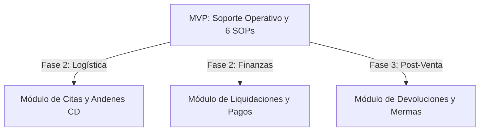

# EP-09 — Modelo de Negocio (Entregables)

Este documento contiene la redacción de todos los entregables del bloque **EP-09 — Modelo de Negocio** para la solución **HimaxIA** de la red de proveedores de Hipermaxi, desarrollado por el equipo **LosQuematokens**.

---

## 1. Propuesta de Valor Diferencial (EP-09-S01)

Para construir una propuesta de valor de alto impacto que convenza al jurado, dividimos el valor de **HimaxIA** en dos perspectivas simétricas: el cliente B2B que adquiere la solución (**Hipermaxi**) y el usuario operativo del portal (**El Proveedor**).

### Tabla de Valor Diferencial y Beneficios Cuantificables

| Dimensión | Valor Estratégico | Beneficios Concretos y Cuantificables |
| :--- | :--- | :--- |
| **Para Hipermaxi** *(Cliente B2B)* | **Optimización y Formalidad:** - Reducción radical de carga operativa básica. - Formalización de la comunicación. - Trazabilidad integral de las interacciones. | 1. **Reducción del 70% en la carga operativa** del equipo de soporte (Soporte HUB, Compras, TI), al absorber automáticamente consultas sobre accesos y registro de catálogos. 2. **Recuperación de 58 horas mensuales de trabajo operativo** que hoy el personal malgasta actuando como "call center de contraseñas" y respondiendo correos repetitivos. 3. **100% de trazabilidad operativa y mitigación de disputas**, migrando la comunicación desde canales informales (WhatsApp corporativo `+591 78401543`) a un log de auditoría centralizado. |
| **Para el Proveedor** *(Usuario del Portal)* | **Eficiencia y Autonomía:** - Autoservicio 24/7 sin barreras temporales. - Resolución inmediata en pantalla. - Eliminación de fricción operativa. | 1. **Disponibilidad 24/7 y resolución inmediata (en < 5 segundos)** de dudas funcionales, evitando el tiempo de espera promedio actual de 2 a 4 días por correo electrónico. 2. **Mitigación y prevención de errores irreversibles al 0%**, gracias a las alertas automáticas del Copiloto (Nivel 3) que se activan antes de confirmar transacciones críticas (como el envío de AVD o cargas de factura observadas). 3. **Autonomía total en onboarding y credenciales**, permitiéndole al Encargado HUB del proveedor solicitar credenciales (`SOP-SR-01`) y recuperar claves (`SOP-SR-03`) de manera autónoma directamente en el Login. |

### Frase de Posicionamiento para la Portada del Pitch

> **"HimaxIA es el copiloto inteligente B2B que automatiza el soporte operativo de proveedores en el portal de Hipermaxi, transformando el caos de la atención manual por WhatsApp en autoservicio 24/7 libre de fricciones."**

---

## 2. Modelo de Entrega (EP-09-S02)

Para garantizar la viabilidad del proyecto tanto en el contexto competitivo del hackathon como en su potencial de mercado futuro, evaluamos tres modelos de comercialización y distribución.

### Tabla Comparativa de Modelos de Entrega

| Criterio | Opción A: Solución Interna (A Medida) | Opción B: SaaS Vertical (Multi-tenant) | Opción C: Licencia + Implementación |
| :--- | :--- | :--- | :--- |
| **Descripción** | Desarrollo directo y exclusivo integrado como un módulo nativo en el Portal de Hipermaxi. | Plataforma en la nube donde múltiples retailers integran el widget a sus portales pagando una suscripción mensual. | Venta del código base empaquetado más un contrato de consultoría para adaptarlo localmente. |
| **Viabilidad Inmediata** | **Alta (Excelente):** Se monta directamente sobre el MVP del hackathon, adaptado a los 6 SOPs reales de Hipermaxi sin requerir infraestructura compleja de aislamiento. | **Media:** Requiere estructurar servicios multi-tenant en backend, seguridad de bases vectoriales independientes por cliente y configuración de perfiles. | **Baja:** Exige largos procesos de preventa corporativa, análisis a medida por cliente y una estructura legal/operativa inicial muy rígida. |
| **Escalabilidad** | **Baja:** Limitada al portal de Hipermaxi. Cada mejora debe ser implementada cliente por cliente si se decide replicar. | **Excelente:** El widget embebido mediante script tag (`<script src="...">`) es multi-tenant por diseño. Escala a nuevos retailers con costo marginal cero. | **Media:** Replicable pero lenta, ya que requiere consultoría e implementación manual para cada instalación de base de datos. |
| **Riesgo** | **Bajo:** Acotado a la infraestructura interna de Hipermaxi. Menor fricción de ciberseguridad para el cliente inicial. | **Medio-Alto:** Requiere garantizar estricto cumplimiento de protección de datos competitivos entre supermercados rivales. | **Alto:** Elevado costo inicial que puede ahuyentar a clientes medianos y retrasar el inicio de operaciones (Time-to-Value largo). |
| **Revenue Potencial** | **Acotado:** Fee de desarrollo único + Fee mensual fijo de mantenimiento de bajo margen. | **Muy Alto y Recurrente:** Ingresos mensuales (MRR) basados en volumen de consultas o proveedores activos en múltiples cadenas. | **Medio:** Alta inyección de capital inicial por licencia, pero ingresos de mantenimiento anuales planos e inelásticos. |

### Recomendación Justificada: Estrategia Dual de Negocio

> **"Implementaremos la Opción A (Solución Interna) de inmediato para Hipermaxi, apalancando el MVP del hackathon para resolver sus dolores operativos sin barreras comerciales iniciales. A largo plazo, escalaremos a la Opción B (SaaS Vertical) para el sector retail boliviano usando nuestro widget multi-tenant: al estar desacoplado e integrarse mediante un simple tag de JavaScript, HimaxIA se puede embeber en portales de competidores o distribuidoras con un costo de adaptación marginal e ingresos recurrentes (MRR) de alto crecimiento."**

---

## 3. Métricas de Impacto y ROI (EP-09-S03)

### Tabla Comparativa: Antes vs. Después con HimaxIA

| Métrica Operativa | Situación Actual (Antes) | Con HimaxIA (Después) | Impacto Estratégico |
| :--- | :--- | :--- | :--- |
| **% de consultas resueltas sin humanos** | **0%** (Cualquier solicitud de credencial o error de factura exige soporte manual). | **70% - 80%** (El agente resuelve de forma autónoma basándose en los 6 SOPs clave). | **Automatización en primera línea:** Libera por completo a Soporte y Compras de tareas mecánicas. |
| **Tiempo de respuesta promedio** | **2 a 4 días hábiles** (Debido a colas de espera en correo, WhatsApp corporativo y validaciones manuales). | **Segundos (< 5 segundos)** (Interacción conversacional e interactiva 24/7). | **Cero fricción:** El proveedor desbloquea sus operaciones comerciales en tiempo real. |
| **Tasa de errores operativos irreversibles** | **Alta y recurrente** (Subida de facturas inválidas, bloqueos de AVD ya confirmados que exigen soporte técnico). | **Cercana a 0%** (El copiloto introduce validaciones previas y pantallas de confirmación obligatoria). | **Reducción de incidentes en IT:** Evita reprocesos y corrección de bases de datos por tickets fallidos. |
| **Visibilidad en tiempo real** | **Nula (0%)** (El proveedor no sabe en qué cola de soporte está su trámite y debe llamar para consultar). | **100% de trazabilidad** (Logs de interacción en el widget y estado de la consulta disponible en su sesión). | **Transparencia B2B:** Fortalece la relación comercial y reduce llamadas de seguimiento. |
| **Carga de trabajo en Soporte** | **Sobrecarga diaria** (Equipo actuando como call center, resolviendo incidentes repetitivos). | **Liberación de 58-70 horas/mes** (Soporte enfocado únicamente en incidencias complejas y hardware). | **Eficiencia de Personal:** Incremento de la productividad sin ampliar planilla de TI. |

### Cálculo de Retorno de Inversión (ROI) Estimado para Hipermaxi

Para calcular el ahorro mensual y anual recurrente, empleamos la siguiente fórmula explícita:

$$\text{Ahorro Mensual} = \text{Volumen Consultas/mes} \times \% \text{ Automatización} \times \text{Tiempo Promedio de Resolución (horas)} \times \text{Costo por Hora de Soporte}$$

#### Escenarios de ROI Basados en Adopción

* **Escenario Conservador (Pesimista / Adopción Lenta):**
  * *Supuestos:* Adopción inicial de proveedores del 60%, tiempo de consulta resuelto de 24 minutos (0.4 horas), costo operativo de $4 USD/hora.
  * *Cálculo:* $200 \text{ consultas/mes} \times 0.60 \times 0.4 \text{ horas} \times 4 \text{ USD/hora} = \mathbf{\$192 \text{ USD/mes}}$
  * *Ahorro en Horas:* 48 horas de soporte liberadas al mes.
  * *Ahorro Anual:* $\$192 \text{ USD} \times 12 = \mathbf{\$2,304 \text{ USD/año}}$
* **Escenario Moderado (Base / Esperado):**
  * *Supuestos:* Adopción estable del 70%, tiempo de consulta resuelto de 30 minutos (0.5 horas - incluye redacción, validación de archivos e intercambio de mensajes), costo operativo de $4 USD/hora.
  * *Cálculo:* $200 \text{ consultas/mes} \times 0.70 \times 0.5 \text{ horas} \times 4 \text{ USD/hora} = \mathbf{\$280 \text{ USD/mes}}$
  * *Ahorro en Horas:* 70 horas de soporte liberadas al mes (supera el compromiso base de 58 horas de la narrativa del pitch).
  * *Ahorro Anual:* $\$280 \text{ USD} \times 12 = \mathbf{\$3,360 \text{ USD/año}}$
* **Escenario Optimista (Alta Adopción / Mayor fricción resuelta):**
  * *Supuestos:* Adopción del 80% (con copiloto activo en catálogos y facturas), tiempo promedio por consulta de 36 minutos (0.6 horas - por la complejidad del flujo de despacho), costo operativo de $4 USD/hora.
  * *Cálculo:* $200 \text{ consultas/mes} \times 0.80 \times 0.6 \text{ horas} \times 4 \text{ USD/hora} = \mathbf{\$384 \text{ USD/mes}}$
  * *Ahorro en Horas:* 96 horas de soporte liberadas al mes.
  * *Ahorro Anual:* $\$384 \text{ USD} \times 12 = \mathbf{\$4,608 \text{ USD/año}}$

#### Supuestos Clave del Modelo de Negocio

1. **Volumen Base:** 200 consultas operativas mensuales de proveedores (basado en la red activa de proveedores de Hipermaxi y el volumen actual en canales de soporte informal).
2. **Costo de Mano de Obra (Soporte):** \$4 USD por hora. Esto se deriva del salario promedio de un agente de soporte técnico/administrativo en Bolivia (~$650 USD/mes contemplando cargas sociales por 160 horas laborales efectivas).
3. **Tiempo por Consulta Manual:** 30 minutos (0.5h) de tiempo acumulado. No solo incluye la llamada/chat inicial, sino también el ciclo de validación de datos incorrectos, consultas a Compras/TI y corrección final de la solicitud.
4. **Calibración con la Narrativa de 58 horas:** Para lograr exactamente 58.3 horas de ahorro mensual (como se menciona en el Pitch), el tiempo promedio por consulta automatizada es de **25 minutos** (0.416 horas) en el escenario base del 70% de automatización: $200 \times 0.70 \times 0.416\text{h} = 58.3$ horas ahorradas al mes, lo que representa un ahorro de **$233.33 USD/mes** ($2,800 USD/año).

---

## 4. Escalabilidad y Roadmap de Expansión (EP-09-S04)

HimaxIA está diseñado con una arquitectura desacoplada para evolucionar continuamente tanto en el portal de Hipermaxi como en el mercado minorista boliviano.

### Roadmap de Módulos Futuros en Portal Hipermaxi

1. **Módulo de Gestión de Citas y Logística (CADE):**
   * *Descripción:* Asistencia al proveedor para reservar andenes de descarga en Centros de Distribución de Hipermaxi y reprogramación de turnos por demoras en tránsito.
   * *Complejidad:* **Media.** Requiere integración de lectura/escritura en tiempo real con el sistema de gestión de almacenes (WMS).
2. **Módulo de Liquidación de Pagos e Inconsistencias:**
   * *Descripción:* Consultas sobre fechas de pago, descuentos aplicados por mermas o diferencias de precio, y descarga autónoma de extractos de cuenta.
   * *Complejidad:* **Alta.** Requiere integración bidireccional segura con el Core ERP (SAP de Hipermaxi) y estrictas medidas de autenticación financiera.
3. **Módulo de Gestión de Devoluciones y Mermas:**
   * *Descripción:* Guiar al proveedor en el retiro de productos con baja rotación, mermas de perecederos y aprobación digital de notas de crédito.
   * *Complejidad:* **Baja - Media.** Se basa en guías de políticas y consultas puntuales de stock de mermas.

### Argumento de Replicabilidad Sectorial en Bolivia

La arquitectura de HimaxIA es su principal activo comercial:
- **Widget Embebido desacoplado:** Se inyecta en el frontend de cualquier portal web mediante una sola etiqueta `<script>`, eliminando la necesidad de reescribir código en los portales existentes de los clientes.
- **Motor RAG Modular:** El modelo se alimenta de bases documentales jerarquizadas (SOPs).
- **Estándar Retail:** Los procesos operativos (onboarding, carga de catálogos, facturación cruzada con OC y Avisos de Despacho) son idénticos al menos en un 85% entre las cadenas de retail en Bolivia (como Ketal, Fidalga o IC Norte) y en grandes distribuidoras masivas (como Delizia o Alicorp). 

El costo de configurar HimaxIA para una nueva cadena de retail es menor al 15% del costo de desarrollo inicial, lo que permite comercializar el software como un SaaS vertical altamente rentable y con implementación en días.

---

## 5. Contenido para Slides (EP-09-S05)

Este es el contenido textual exacto y estructurado que se entrega al área de diseño (Melina) para la creación de las diapositivas de soporte del Pitch.

---

### Slide 8 (Impacto y ROI)

* **Título del Slide:**  
  `IMPACTO OPERATIVO Y RETORNO DE INVERSIÓN (ROI)`
* **Número Gigante a Destacar:**  
  `70%` (Sub-texto: *de Consultas Automatizadas en Primera Línea*)  
  `+58 Horas` (Sub-texto: *Recuperadas al Mes para Soporte Operativo*)
* **Tabla Resumen de Métricas (Antes vs. Después):**
  
  | Indicador Clave | Situación Actual (Antes) | Con HimaxIA (Después) |
  | :--- | :--- | :--- |
  | **Consultas resueltas sin humanos** | 0% | **70% - 80%** |
  | **Tiempo de respuesta promedio** | 2 a 4 días hábiles | **Menos de 5 segundos** |
  | **Errores operativos en AVD / Facturas** | Frecuentes e Irreversibles | **Cero (Prevenidos por Copiloto)** |
  | **Trazabilidad de solicitudes** | Nula (WhatsApp informal) | **100% Auditables en Portal** |
  | **Costo Operativo Mensual de Soporte** | Alto (Soporte sobrecargado) | **$3,360 USD Ahorrados al Año** |

* **Pie de Slide (Fuente de Datos):**  
  *Fuente: Simulación operativa basada en los 6 SOPs oficiales de Hipermaxi y costos de soporte promedio en Bolivia (~$4 USD/hora).*

---

### Slide 9 (Sostenibilidad y Escalabilidad)

* **Título del Slide:**  
  `SOSTENIBILIDAD Y ROADMAP DE EXPANSIÓN`
* **Modelo Dual Recomendado (Resumen Ejecutivo):**
  * **Estrategia Comercial Dual:**
    * **Fase 1 (MVP Localizado):** Solución Interna Directa para Hipermaxi, validando el motor conversacional y el copiloto.
    * **Fase 2 (SaaS Vertical):** Comercialización de HimaxIA mediante Widget Embebido Multi-tenant a otras cadenas de retail en Bolivia (MRR).
* **Camino de Crecimiento (3 Bullets de Expansión):**
  * 🛢️ **Módulo Logística & Citas (CADE):** Automatización de agendas y andenes en centros de distribución.
  * 💳 **Módulo Finanzas & Pagos:** Autoservicio de liquidaciones y facturas pendientes.
  * 📦 **Módulo Mermas & Devoluciones:** Flujo digital autónomo para retiro y mermas de stock.
* **Frase de Visión a Largo Plazo:**  
  `"HimaxIA: Transformando la comunicación operativa del retail boliviano en un estándar inteligente, escalable y libre de fricción."`

---

### Briefing Técnico y de Diseño para Melina (Instrucciones UI/UX)

> **Hola Melina,**  
> Para los slides 8 y 9 necesitamos una jerarquía visual muy clara y premium, alineada a la identidad digital de Hipermaxi pero con un aire tecnológico moderno (estilo dark-mode con acentos vibrantes):
> 
> 1. **Slide 8 (Impacto y ROI):**  
>    - **Jerarquía:** Coloca a la izquierda de la pantalla los dos datos gigantes en un tamaño de fuente de al menos **72px** (`70%` y `+58 Horas`) con un color verde lima o cian brillante sobre fondos oscuros. Debajo de ellos, pon sus breves descripciones explicativas.
>    - **Tabla:** Colócala a la derecha en una tarjeta flotante con efecto *glassmorphism* (fondo semi-transparente difuminado). Utiliza iconos visuales directos en vez de texto plano para las métricas del "Antes" (cruz roja o icono de reloj de arena) y "Después" (check verde brillante o rayo de rapidez).
>    - **Colores sugeridos:** Fondo gris muy oscuro (`#121212`), acentos en verde lima (`#A3E635`) para resaltar el ahorro y azul Hipermaxi suave (`#3B82F6`).
> 
> 2. **Slide 9 (Sostenibilidad y Escalabilidad):**  
>    - **Estructura:** Divide el slide visualmente en dos bloques. El bloque superior explica de forma muy limpia la **Estrategia Dual** (puedes representarlo con dos tarjetas conectadas por una flecha de flujo: *Fase 1: Implementación Local* $\rightarrow$ *Fase 2: SaaS Multi-Tenant*).
>    - **Línea de Tiempo/Módulos:** El bloque inferior debe mostrar una línea horizontal o un flujo secuencial con 3 iconos representativos para la expansión del roadmap (un camión para Logística, una tarjeta de crédito para Pagos, y una caja para Devoluciones).
>    - **Frase de Cierre:** Pon la frase de visión a largo plazo al final con una tipografía elegante, destacada y con buen espaciado.
>    - **Tipografías recomendadas:** Inter o Outfit para lograr un estilo moderno que se aleje de las tipografías por defecto del navegador.
