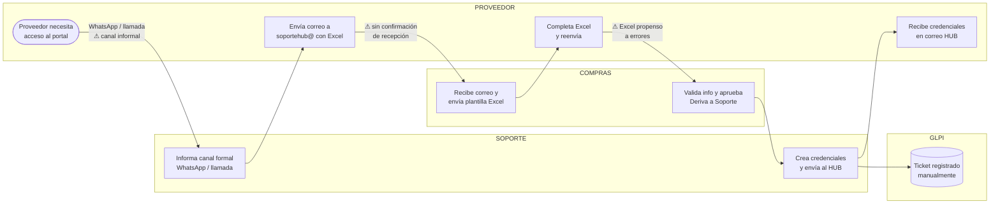
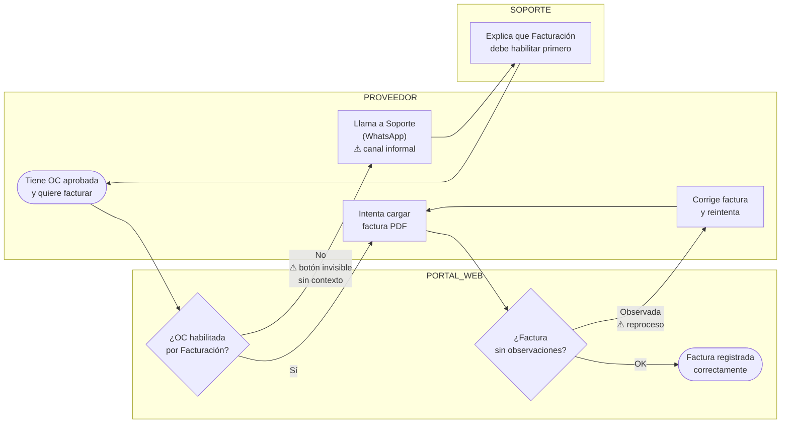
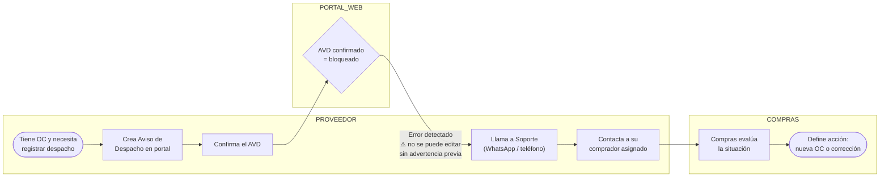
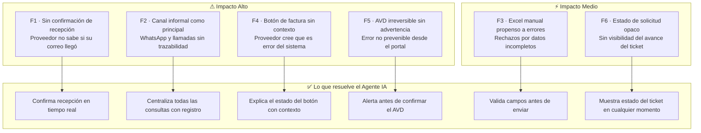

# EP-01-S02 — Diagrama de Flujo de Procesos Actuales (AS-IS)

> **Proyecto:** Asistente Virtual de Soporte — Portal de Proveedores Hipermaxi  
> **Sprint:** EP-01 · Subtask S02  
> **Basado en:** SOP-SR-01, SOP-SR-02, SOP-SR-03, SOP-04, SOP-05, SOP-06

---

## S1 — Actores y canales actuales

| Actor | Rol | Canales actuales | Fricción |
|---|---|---|---|
| **Proveedor** (Encargado HUB / Sistemas) | Solicitante | WhatsApp, correo, llamada | Sin trazabilidad |
| **Soporte Hipermaxi** | Área técnica interna | WhatsApp +591 78401543, teléfono, soporteti@ | Canal informal como principal |
| **Área de Compras** | Validación comercial | soportehub@, Excel manual | Proceso opaco para el proveedor |
| **Sistema GLPI** | Gestión de tickets | Registro manual por Soporte | Sin notificaciones automáticas |

---

## S2 — AS-IS: Solicitud de credenciales (SOP-SR-01)

**Puntos de fricción identificados:**
- ⚠ F1 — El proveedor contacta por WhatsApp/llamada antes de saber el proceso formal
- ⚠ F2 — No hay confirmación automática de recepción del correo
- ⚠ F3 — El Excel manual es propenso a errores y genera rechazos
- ⚠ F6 — El estado del ticket no es visible para el proveedor

---

## S3 — AS-IS: Carga de factura (SOP-05)

**Puntos de fricción identificados:**
- ⚠ F4 — El botón de factura no aparece sin contexto: el proveedor cree que es un error del sistema
- ⚠ F2 — La consulta se resuelve por WhatsApp, sin registro
- ⚠ Reproceso — Si la factura tiene observaciones, el proveedor debe corregir y reintentar sin guía clara

---

## S4 — AS-IS: Aviso de Despacho (SOP-06)

**Puntos de fricción identificados:**
- ⚠ F5 — El sistema confirma el AVD sin advertencia de irreversibilidad
- ⚠ F5 — Un AVD con error obliga al proveedor a contactar a su comprador por fuera del portal
- ⚠ F2 — La resolución pasa por WhatsApp/llamada sin trazabilidad

---

## S5 — Consolidado de puntos de fricción

---

## Resumen ejecutivo

| # | Fricción | Proceso | Impacto | Solución IA |
|---|---|---|---|---|
| F1 | Sin confirmación de recepción de correo | SR-01, SR-02, SR-03 | Alto | Confirmación en tiempo real |
| F2 | WhatsApp/llamadas como canal principal | Todos | Alto | Canal centralizado con trazabilidad |
| F3 | Excel manual propenso a errores | SR-01, SR-02 | Medio | Formulario guiado con validación |
| F4 | Botón de factura invisible sin contexto | SOP-05 | Alto | Explicación contextual en el portal |
| F5 | AVD irreversible sin advertencia previa | SOP-06 | Alto | Alerta de confirmación obligatoria |
| F6 | Estado del ticket opaco | SR-01 a SR-03 | Medio | Dashboard de estado en tiempo real |
