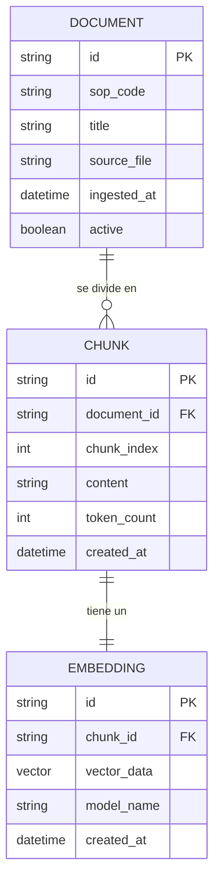

# EP-02 — Base de Conocimiento

**Objetivo asociado:** Estructurar, procesar e indexar los SOPs de Hipermaxi como fuente de recuperación semántica del agente IA.
**Estado:** In Progress
**Bloque:** Bloque 2 (Sáb 14:00 – 17:30)
**Responsables principales:** Luis / Nathanael (+ Adrián en S04–S05)
**Bloquea:** EP-03 (Agente IA — Motor conversacional)
**Depende de:** EP-01 — Casos de uso definidos (EP-01-S01), fricciones documentadas (EP-01-S02), stack tecnológico confirmado (EP-01-S04)

---

## Architectural Context

EP-02 implementa el pipeline RAG (Retrieval-Augmented Generation) que sirve como memoria a largo plazo del agente. Su responsabilidad es transformar los 6 SOPs en texto entregados por Hipermaxi en fragmentos semánticos indexados y recuperables por similitud vectorial.

El stack confirmado en EP-01-S04 define: backend en **Python / FastAPI**, despliegue en contenedores Docker sobre Azure, y LLMs open-source (Llama 4 / Qwen / Gemma). La base vectorial debe ser compatible con este stack y desplegable dentro del tiempo del hackathon.

Estructura interna del pipeline:

```
DocumentIngestionService
    ├── DocumentLoader          — carga y normaliza cada SOP desde texto plano
    ├── ChunkingService         — divide en fragmentos con overlap configurable
    ├── EmbeddingService        — genera embeddings vía modelo de embeddings local o API
    └── VectorStoreRepository   — persiste y consulta embeddings en la DB vectorial
              └── IVectorStore (interfaz) → SupabaseVectorImpl | ChromaImpl
```

---

## Domain Model

### Entity-Relationship Diagram



### Model notes

**[DOCUMENT]:** Representa un SOP completo. `sop_code` es el identificador del proceso (ej. `SOP-SR-01`, `SOP-05`). `active` permite desactivar versiones obsoletas sin eliminar registros — importante para mantener historial en producción.

**[CHUNK]:** Fragmento de texto procesable. `chunk_index` preserva el orden original para reconstruir contexto. `token_count` permite al agente calcular el presupuesto de tokens antes de armar el prompt final.

**[EMBEDDING]:** Vector de alta dimensión generado por el modelo de embeddings. `model_name` registra el modelo usado (ej. `text-embedding-3-small`, `nomic-embed-text`) para garantizar consistencia en queries — mezclar modelos de embeddings distintos corrompe los resultados de similitud.

---

## Stories & Sub-tasks

### EP-02-S01 — Preparación y normalización de fuentes

**Responsable:** Luis / Nathanael

**Criterio de aceptación:** Los 6 SOPs de Hipermaxi están disponibles en formato texto plano limpio, normalizados (sin artefactos de formato, encabezados consistentes, secciones etiquetadas), listos para ser procesados por el pipeline de chunking. Verificado mediante inspección manual de al menos 2 SOPs.

| Sub-tarea | Entregable | Estado |
|---|---|---|
| EP-02-S01-T01 | Extracción de texto de los 6 SOPs desde `.docx` a `.txt` o `.md` limpio | To Do |
| EP-02-S01-T02 | Normalización: eliminación de ruido (headers de Word, numeraciones inconsistentes, caracteres especiales) | To Do |
| EP-02-S01-T03 | Etiquetado de secciones por SOP: código, título, pasos, actores, errores frecuentes | To Do |
| EP-02-S01-T04 | Registro en tabla `DOCUMENT` con `sop_code`, `title` y `source_file` para los 6 documentos | To Do |

---

### EP-02-S02 — Pipeline de chunking

**Responsable:** Nathanael

**Criterio de aceptación:** El servicio de chunking procesa un documento normalizado y produce fragmentos de entre 200 y 400 tokens con un overlap de 50 tokens entre chunks consecutivos. Los chunks preservan el contexto de la sección de origen (ej. un chunk no mezcla pasos de dos SOPs distintos). Verificado con el SOP de mayor extensión (SOP-04 o SOP-05).

| Sub-tarea | Entregable | Estado |
|---|---|---|
| EP-02-S02-T01 | `ChunkingService.chunk(document: str, chunk_size: int, overlap: int) -> List[Chunk]` | To Do |
| EP-02-S02-T02 | Lógica de respeto de límites de sección: un chunk no cruza el boundary entre dos pasos numerados | To Do |
| EP-02-S02-T03 | Persistencia de chunks en tabla `CHUNK` con `document_id`, `chunk_index` y `token_count` | To Do |
| EP-02-S02-T04 | Script de validación: conteo de chunks por SOP y verificación de que ningún chunk supera 400 tokens | To Do |

---

### EP-02-S03 — Generación de embeddings

**Responsable:** Luis

**Criterio de aceptación:** Todos los chunks de los 6 SOPs tienen su embedding generado y persistido en la tabla `EMBEDDING`. El modelo de embeddings usado es consistente para todos los documentos. La generación completa de los 6 SOPs se ejecuta en menos de 5 minutos en el entorno de desarrollo.

| Sub-tarea | Entregable | Estado |
|---|---|---|
| EP-02-S03-T01 | `EmbeddingService.embed(chunks: List[Chunk]) -> List[Embedding]` con modelo configurable | To Do |
| EP-02-S03-T02 | Integración con el modelo de embeddings seleccionado (nomic-embed-text local o text-embedding-3-small vía API) | To Do |
| EP-02-S03-T03 | Persistencia en tabla `EMBEDDING` con `chunk_id`, `vector_data` y `model_name` | To Do |
| EP-02-S03-T04 | Script de ingesta completa: ejecuta S01 + S02 + S03 en un solo comando (`python ingest.py`) | To Do |

---

### EP-02-S04 — Vector store y recuperación semántica

**Responsable:** Nathanael / Adrián

**Criterio de aceptación:** Dado un query en lenguaje natural (ej. "¿cómo cargo mi factura?"), el sistema retorna los 3 chunks más relevantes con un score de similitud coseno ≥ 0.75. El tiempo de respuesta del retrieval es menor a 500ms. Verificado con al menos 5 queries representativos de los casos de uso UC-01 a UC-06.

| Sub-tarea | Entregable | Estado |
|---|---|---|
| EP-02-S04-T01 | Configuración e inicialización del vector store (Supabase pgvector o ChromaDB según disponibilidad) | To Do |
| EP-02-S04-T02 | `VectorStoreRepository.search(query_embedding: vector, top_k: int) -> List[ChunkResult]` | To Do |
| EP-02-S04-T03 | Endpoint `POST /knowledge/search` — recibe `{ query: string, top_k: int }`, retorna chunks con scores | To Do |
| EP-02-S04-T04 | Test de retrieval: 5 queries de los casos de uso UC-01 a UC-06 con validación de relevancia manual | To Do |

---

### EP-02-S05 — Validación de cobertura de la base de conocimiento

**Responsable:** Adrián + Diego (revisión)

**Criterio de aceptación:** Los 6 casos de uso definidos en EP-01-S01 tienen al menos 2 chunks relevantes recuperables con score ≥ 0.75. Las 6 fricciones documentadas en EP-01-S02 (F1–F6) tienen cobertura en la base de conocimiento. Documentado en una tabla de cobertura UC vs chunks.

| Sub-tarea | Entregable | Estado |
|---|---|---|
| EP-02-S05-T01 | Tabla de cobertura: UC-01 a UC-06 vs chunks recuperados + scores | To Do |
| EP-02-S05-T02 | Tabla de cobertura: F1 a F6 (fricciones AS-IS) vs chunks que las abordan | To Do |
| EP-02-S05-T03 | Identificación de gaps: preguntas frecuentes sin cobertura adecuada → propuesta de enriquecimiento manual | To Do |

---

## Implementation Notes

**Selección del vector store:** Para el MVP en hackathon se prefiere **ChromaDB en memoria o en disco local** sobre Supabase pgvector. ChromaDB no requiere instancia de base de datos externa, se instala con `pip install chromadb` y funciona en el mismo proceso de FastAPI. Si el equipo ya tiene Supabase configurado para otra épica, migrar a pgvector es trivial dado que `IVectorStore` abstrae la implementación.

**Selección del modelo de embeddings:** `nomic-embed-text` (disponible vía Ollama local, gratuito, 768 dimensiones) es la opción recomendada para no depender de APIs externas durante la demo. Alternativa: `text-embedding-3-small` de OpenAI (1536 dimensiones, $0.02/1M tokens) si el equipo ya tiene API key disponible. La elección debe ser consistente entre ingesta y query — registrar `model_name` en `EMBEDDING` previene errores silenciosos.

**Chunking strategy:** Los SOPs de Hipermaxi tienen estructura de pasos numerados. El chunking debe respetar los límites de paso: un chunk no debe partir un paso numerado por la mitad. Implementar usando separadores semánticos (`\n\n`, `\n- `, numeración) antes del fallback por tamaño de token.

**Seguridad del pipeline:** La base de conocimiento solo debe contener los 6 SOPs entregados por Hipermaxi. No indexar texto libre del usuario ni mensajes del chat — esto previene ataques de envenenamiento de la base de conocimiento (data poisoning) que podrían afectar las respuestas del agente.

**Volumen esperado:** Los 6 SOPs en conjunto estiman entre 150 y 400 chunks totales. Este volumen es manejable en memoria con ChromaDB sin necesidad de optimizaciones de índice (HNSW, IVF) que solo son necesarias a partir de ~10,000 vectores.

---

## Configuration Guide

### Step 1 — Setup del entorno Python

1. Crear entorno virtual: `python -m venv .venv && source .venv/bin/activate`
2. Instalar dependencias: `pip install fastapi chromadb sentence-transformers python-docx tiktoken`
3. Verificar instalación: `python -c "import chromadb; print(chromadb.__version__)"`

> Si se opta por Supabase pgvector en lugar de ChromaDB, instalar `pip install supabase vecs` y configurar las variables de entorno `SUPABASE_URL` y `SUPABASE_KEY`.

---

### Step 2 — Preparación de documentos fuente

Navigation path: **Repositorio del proyecto → `/knowledge/raw/`**

1. Copiar los 6 archivos `.docx` de los SOPs al directorio `/knowledge/raw/`.
2. Ejecutar el script de extracción: `python scripts/extract_docs.py` — genera archivos `.txt` limpios en `/knowledge/processed/`.
3. Revisar manualmente al menos 2 archivos `.txt` para confirmar que el texto está limpio y las secciones están correctamente separadas.

> Los archivos `.docx` originales no deben modificarse — son la fuente de verdad. El pipeline trabaja siempre sobre las copias procesadas.

---

### Step 3 — Ejecución del pipeline de ingesta

1. Ejecutar: `python ingest.py --source /knowledge/processed/ --model nomic-embed-text`
2. Verificar en la salida que los 6 documentos fueron procesados y el total de chunks generados es coherente (esperado: 150–400).
3. Confirmar que el vector store fue inicializado y persistido en `/knowledge/vector_store/`.

> Este comando es idempotente: si se ejecuta dos veces con los mismos documentos, no duplica registros. Implementar verificación por `sop_code` antes de insertar.

---

### Step 4 — Verificación del retrieval

1. Levantar el servidor: `uvicorn main:app --reload`
2. Ejecutar el test de retrieval: `python scripts/test_retrieval.py` — prueba los 6 casos de uso y reporta scores.
3. Confirmar que todos los UC obtienen al menos 2 chunks con score ≥ 0.75.

---

## References

- EP-01-S01 Casos de Uso — `casos_de_uso.txt`
- EP-01-S02 Diagrama AS-IS y fricciones — `flujo_as_is.md`
- EP-01-S04 Stack Tecnológico — `EP-01-S04_Stack_Tecnológico_del_Portal_Existente.md`
- SOP-SR-01 Credenciales de Acceso — `CREDENCIALES_DE_ACCESO.docx`
- SOP-SR-02 Activación de Código Proveedor — `ACTIVACIO_N_DE_CO_DIGO_PROVEEDOR.docx`
- SOP-SR-03 Reenvío de Credenciales — `REENVI_O_DE_CREDENCIALES_DE_ACCESO.docx`
- SOP-04 Registro de Productos — `ASISTENCIA_AL_CARGAR_UN_PRODUCTO_AL_PORTAL_WEB.docx`
- SOP-05 Carga de Facturas — `ASISTENCIA_AL_CARGAR_FACTURA.docx`
- SOP-06 Aviso de Despacho — `ASISTENCIA_EN_AVD.docx`
- ChromaDB docs — https://docs.trychroma.com
- EP-03 Agente IA (bloqueada por esta épica)
