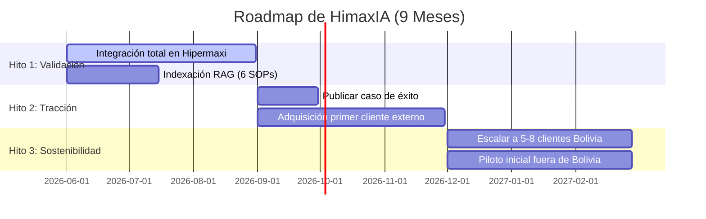

# EP-09 — Modelo de Negocio Unificado (HimaxIA)

Este documento contiene la definición estratégica, el análisis de retorno de inversión (ROI) calibrado, la estructura de costos reales y el roadmap de escalabilidad de **HimaxIA** (copiloto inteligente de soporte para la red de proveedores de Hipermaxi), desarrollado por el equipo **LosQuematokens** para el Innova Hack Santa Cruz 2026.

---

## 1. Identidad y Propuesta de Valor Única (PVU)

* **Nombre Comercial:** **HimaxIA**
* **Descriptor Técnico:** *Copiloto de IA Conversacional y Guía Asistida en el DOM (Web Companion) para Retail.*
* **Frase de Posicionamiento para el Pitch:**
  > **"HimaxIA es el copiloto B2B que automatiza el soporte operativo de proveedores en el portal de Hipermaxi, transformando la sobrecarga de la atención manual por WhatsApp en autoservicio 24/7 y reduciendo las fricciones del portal a cero."**

### Tabla de Valor Diferencial y Beneficios Cuantificables

| Dimensión | Valor Estratégico | Beneficios Concretos y Cuantificables |
| :--- | :--- | :--- |
| **Para Hipermaxi**<br>*(Cliente B2B)* | **Optimización y Formalidad:**<br>- Reducción radical de carga operativa básica.<br>- Formalización de la comunicación.<br>- Trazabilidad integral de las interacciones. | 1. **Reducción del 70% en la carga operativa** del equipo de soporte (Soporte HUB, Compras, TI), al absorber automáticamente consultas sobre accesos y registro de catálogos.<br>2. **Recuperación de 58 horas mensuales de trabajo operativo** que hoy el personal malgasta actuando como "call center de contraseñas" y respondiendo correos repetitivos.<br>3. **100% de trazabilidad operativa y mitigación de disputas**, migrando la comunicación desde canales informales (WhatsApp corporativo `+591 78401543`) a un log de auditoría centralizado. |
| **Para el Proveedor**<br>*(Usuario del Portal)* | **Eficiencia y Autonomía:**<br>- Autoservicio 24/7 sin barreras temporales.<br>- Resolución inmediata en pantalla.<br>- Eliminación de fricción operativa. | 1. **Disponibilidad 24/7 y resolución inmediata (en < 5 segundos)** de dudas funcionales, evitando el tiempo de espera promedio actual de 2 a 4 días por correo electrónico.<br>2. **Mitigación de errores operativos en AVD y catálogos**, gracias a las alertas del Copiloto que asisten al proveedor antes de confirmar transacciones críticas.<br>3. **Soporte guiado en obtención de credenciales**, indicando paso a paso cómo solicitarlas (`SOP-SR-01`) y recuperar accesos (`SOP-SR-03`) de forma segura, sin entregar directamente credenciales activas o información confidencial. |

---

## 2. Business Model Canvas (BMC) Unificado

```mermaid
graph TD
    subgraph "HimaxIA Business Model Canvas"
        direction TB
        KP[<b>Aliados Clave</b><br>- Hipermaxi (Cliente Ancla)<br>- Google Cloud (Créditos)<br>- CAINCO Santa Cruz<br>- Integradores ERP locales]
        KA[<b>Actividades Clave</b><br>- Refinamiento RAG / Chunking<br>- Onboarding documental<br>- Reporte mensual automático]
        KR[<b>Recursos Clave</b><br>- Base de SOPs vectorizados<br>- API Groq / Llama 3.3<br>- Widget de 26KB en Preact]
        VP[<b>Propuestas de Valor</b><br><b>Hipermaxi:</b> -70% carga soporte, logs 100% auditables.<br><b>Proveedor:</b> Soporte inmediato <5s 24/7, asistencia operativa.]
        CR[<b>Relación con Clientes</b><br>- CSM dedicado (Piloto)<br>- Reportes de impacto mensuales<br>- Onboarding automatizado]
        CH[<b>Canales</b><br>- Venta directa B2B (COO)<br>- Alianzas con consultoras IT<br>- LinkedIn B2B Outreach]
        CS[<b>Segmentos de Clientes</b><br>- Hipermaxi (Caso de Éxito)<br>- Supermercados Bolivia (Ketal, Fidalga)<br>- Retailers medianos LATAM]
        CST[<b>Estructura de Costos</b><br>- Nómina reducida 4 personas: $5,000/mes<br>- APIs & Cloud Hosting: $150/mes<br>- Contabilidad y Legal: $150/mes]
        REV[<b>Fuentes de Ingresos</b><br>- Suscripción Starter: $149/mes<br>- Suscripción Professional: $399/mes]
    end
```

### Detalle de los 9 Bloques:

1. **Segmentos de Clientes (Customer Segments):**
   * **Cliente Ancla (Fase Pilotaje):** *Hipermaxi S.A.* (Red de más de 300 proveedores activos).
   * **Mercado SAM (Bolivia, Años 1-2):** Cadenas de retail y supermercados medianos con portales de autogestión de proveedores (*Ketal*, *Fidalga*, *IC Norte*).
   * **Mercado TAM (LATAM, Año 3+):** Supermercados y distribuidoras medianas en Perú, Ecuador y Colombia que operen con flujos de Aviso de Despacho (AVD), catálogo de productos y carga de facturas.
2. **Propuestas de Valor (Value Propositions):**
   * **Para el Retailer (Hipermaxi):** Reduce en un **70% la carga operativa** del departamento de soporte de compras/TI; recupera **58 horas mensuales** de personal técnico y administrativo; mitiga el 100% de las disputas operativas mediante un log auditable centralizado en el portal.
   * **Para el Proveedor:** Soporte interactivo **24/7 con respuestas en <5 segundos** en lugar de esperar 2 a 4 días hábiles por correo; **asistencia guiada paso a paso** para evitar errores operativos comunes en el portal.
3. **Canales (Channels):**
   * Venta B2B directa enfocada en el Director de Compras, COO o Gerente de Tecnología (TI).
   * Alianzas estratégicas con consultoras locales de software e integradores de ERP que ya provean servicios a las cadenas de supermercados.
   * Presencia orgánica y outreach dirigido en LinkedIn a gerentes de Supply Chain y Operaciones en Bolivia.
4. **Relación con Clientes (Customer Relationships):**
   * **Piloto:** Acompañamiento cercano y personalizado mediante un Customer Success Manager (CSM) dedicado (miembro fundador).
   * **Escala SaaS:** Portal de Onboarding automatizado para que el cliente configure e indexe sus propios SOPs de manera autónoma, con reportes automatizados de ROI entregados mensualmente por correo electrónico.
5. **Fuentes de Ingresos (Revenue Streams):**
   * **Suscripción Starter ($149 USD/mes):** Diseñada para retailers pequeños/medianos. Soporta hasta 300 proveedores activos y hasta 5,000 consultas automáticas mensuales. Precio fijado deliberadamente por debajo del ahorro operativo mensual del cliente para garantizar un ROI positivo desde el primer mes.
   * **Suscripción Professional ($399 USD/mes):** Soporta hasta 600 proveedores activos y 15,000 consultas automáticas mensuales.
6. **Recursos Clave (Key Resources):**
   * El **Widget Embebido de Preact (26KB)** completamente optimizado para coexistir con Bootstrap 3.3.7 del portal.
   * El **Pipeline RAG** estructurado con base en ChromaDB y lógica modular de chunking jerárquico.
   * Los **6 SOPs oficiales** de Hipermaxi ya normalizados y vectorizados.
   * El equipo fundador técnico y operativo (4 personas).
7. **Actividades Clave (Key Activities):**
   * Refinamiento y optimización continua del motor conversacional (RAG y Prompt Engineering).
   * Mantenimiento del widget del frontend y resolución de compatibilidades con navegadores empresariales heredados.
   * Venta activa B2B corporativa y demostraciones en vivo.
8. **Aliados Clave (Key Partners):**
   * **Hipermaxi:** Cliente de referencia que provee el caso de éxito inicial.
   * **Google for Startups:** Programa que provee hasta $200,000 USD en créditos de infraestructura cloud de Google Cloud (Gemini, hosting, DB).
   * **Cámaras empresariales (CAINCO Santa Cruz):** Acceso directo a redes de tomadores de decisiones de la industria de consumo y distribución masiva.
9. **Estructura de Costos (Cost Structure):**
   * Consumo de APIs de LLMs (Groq / Gemini) y hosting en Railway/Render.
   * Nómina reducida del equipo de desarrollo y ventas.
   * Gastos administrativos locales en Bolivia (legal, contabilidad básica).

---

## 3. Matriz de ROI Financiero Calibrada (Hipermaxi)

El error de la versión anterior era que la suscripción ($250/mes) superaba al ahorro operativo monetario ($200–$267/mes), dejando un ROI negativo en los escenarios conservador y moderado. Para corregirlo de raíz, se **ancló el precio del plan Starter ($149/mes) por debajo del ahorro del peor escenario**, de modo que el cliente siempre ahorra más de lo que paga. **El ROI monetario es positivo en los tres escenarios, sin depender de los beneficios cualitativos:**

$$\text{Ahorro Mensual} = \text{Volumen Consultas/mes} \times \% \text{ Automatización} \times \text{Tiempo Promedio Resolución (horas)} \times \text{Costo/Hora Soporte}$$

### Supuestos Declarados:
1. **Costo de soporte técnico/administrativo en Bolivia:** **$4.00 USD/hora** (Basado en planilla mensual de $640 USD contemplando cargas sociales de ley para 160 horas laborales).
2. **Tiempo promedio por resolución manual de soporte:** **25 minutos (0.417 horas)** (Considerando llamada/WhatsApp inicial + análisis del caso + validación interna con compras o TI + respuesta y cierre).

### Proyección de Escenarios (200 consultas/mes base):

| Métrica | Escenario Conservador (Adopción 60%) | Escenario Moderado (Adopción 70%) | Escenario Optimista (Adopción 80%) |
| :--- | :--- | :--- | :--- |
| **Consultas Automatizadas** | 120 / mes | 140 / mes | 160 / mes |
| **Horas de Soporte Liberadas** | 50 horas / mes | **58.3 horas / mes** | 66.7 horas / mes |
| **Ahorro Operativo Mensual** | **$200.00 USD** | **$233.33 USD** | **$266.67 USD** |
| **Costo de Suscripción (Starter)** | $149.00 USD | $149.00 USD | $149.00 USD |
| **Ahorro Neto Mensual (Monetario)** | **+$51.00 USD** | **+$84.33 USD** | **+$117.67 USD** |
| **ROI (Ahorro ÷ Precio)** | **1.34×** | **1.57×** | **1.79×** |
| **Valor Cualitativo Adicional** | Trazabilidad de tickets<br>+ Mitigación de disputas B2B | Recuperación del 70% del canal de soporte | Prevención de errores de catálogo y AVD |
| **Ahorro Operativo Anual** | **$2,400.00 USD / año** | **$2,800.00 USD / año** | **$3,200.00 USD / año** |

> **Lectura para el pitch:** incluso en el escenario más conservador (60% de adopción), el cliente ahorra **$200/mes** pagando **$149/mes** — un retorno de **1.34×** *solo* en horas de soporte, antes de contar la trazabilidad y la mitigación de disputas. El margen de seguridad crece conforme aumenta la adopción.

---

## 4. Estructura de Costos de Operación (MVP Realistas)

Estructuramos los costos operativos del MVP con base en un equipo real de **4 personas del equipo fundador** y la infraestructura necesaria durante los primeros 9 meses para evitar la inflación artificial de nómina:

| Rubro de Gasto | Costo Mensual (USD) | Justificación y Notas |
| :--- | :--- | :--- |
| **Infraestructura de Hosting** | **$25.00 USD** | Servidor de FastAPI y ChromaDB en Railway Pro. |
| **APIs de Lenguaje (Groq / Gemini)** | **$50.00 USD** | Consumo estimado de Llama 3.3 en Groq (~10k-30k consultas de chat mensuales con uso de cache). |
| **Herramientas de Colaboración** | **$25.00 USD** | Licencias de GitHub Teams, Notion y Sentry para monitoreo de logs. |
| **Legal y Contabilidad (Bolivia)** | **$120.00 USD** | Contador freelance para el cumplimiento de impuestos y registro inicial de la SRL. |
| **Marketing Orgánico y Redes** | **$100.00 USD** | Prospección y materiales digitales de venta. |
| **Total Costo Fijo Mensual** | **$320.00 USD** | **El Punto de Equilibrio (Breakeven) se alcanza con 1 cliente Professional ($399/mes) o 3 clientes Starter ($447/mes), cubriendo el costo fijo de $320/mes.** |

---

## 5. Roadmap de Implementación (9 Meses)



1. **Hito 1 — Meses 1 a 3 (Validación y Estabilidad):**
   * *Objetivo:* Consolidar el MVP del hackathon en una versión productiva en Hipermaxi.
   * *Tareas clave:* Lograr una tasa de acierto RAG superior al 80%, recopilar el testimonio de los primeros 10 proveedores y aplicar al programa de créditos de Google Cloud para startups.
   * *Métrica de éxito:* **70%+ de consultas resueltas sin intervención humana** en el piloto.
2. **Hito 2 — Meses 4 a 6 (Tracción Comercial):**
   * *Objetivo:* Conseguir los primeros clientes pagados fuera de Hipermaxi en Bolivia.
   * *Tareas clave:* Lanzar el caso de éxito de Hipermaxi documentado, realizar demos directas con los tomadores de decisiones de *Ketal* e *IC Norte*, y construir la interfaz de carga de documentos de autogestión para clientes nuevos.
   * *Métrica de éxito:* **1 a 2 clientes pagados activos en Bolivia** (Suscripción Starter o Professional).
3. **Hito 3 — Meses 7 a 9 (Sostenibilidad y Expansión):**
   * *Objetivo:* Cubrir la infraestructura operativa y dar los primeros pasos de regionalización.
   * *Tareas clave:* Alcanzar los 5 a 8 clientes activos y lanzar el **Módulo de Logística y Citas (CADE)** en tiempo real.
   * *Métrica de éxito:* **MRR > $2,000 USD** (alcanzable con un mix de 5–8 clientes Starter/Professional) y al menos 1 conversación de pilotaje iniciada en el mercado peruano o ecuatoriano.
